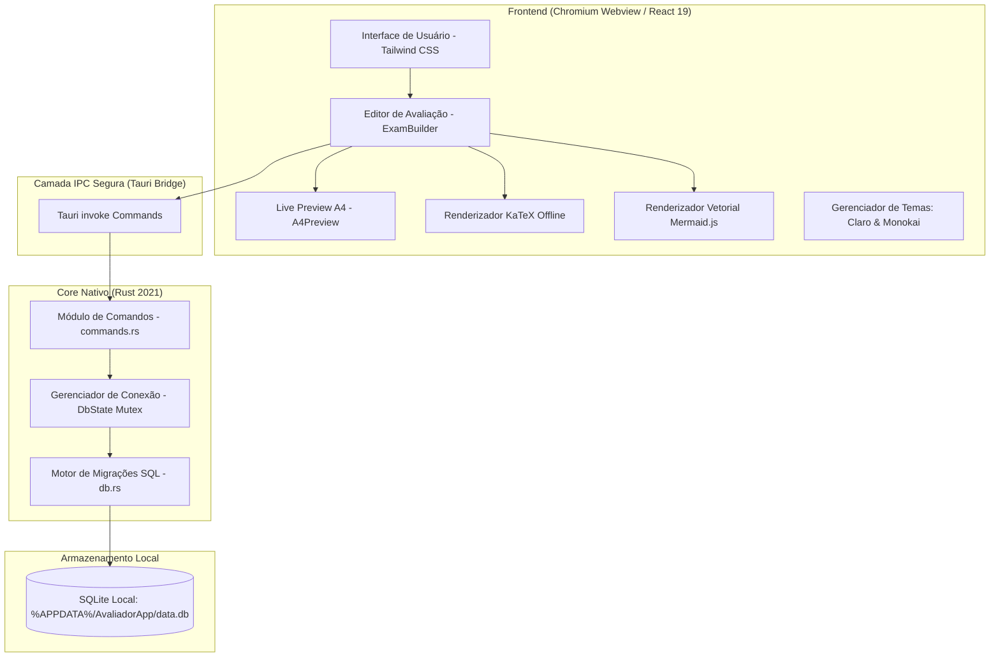
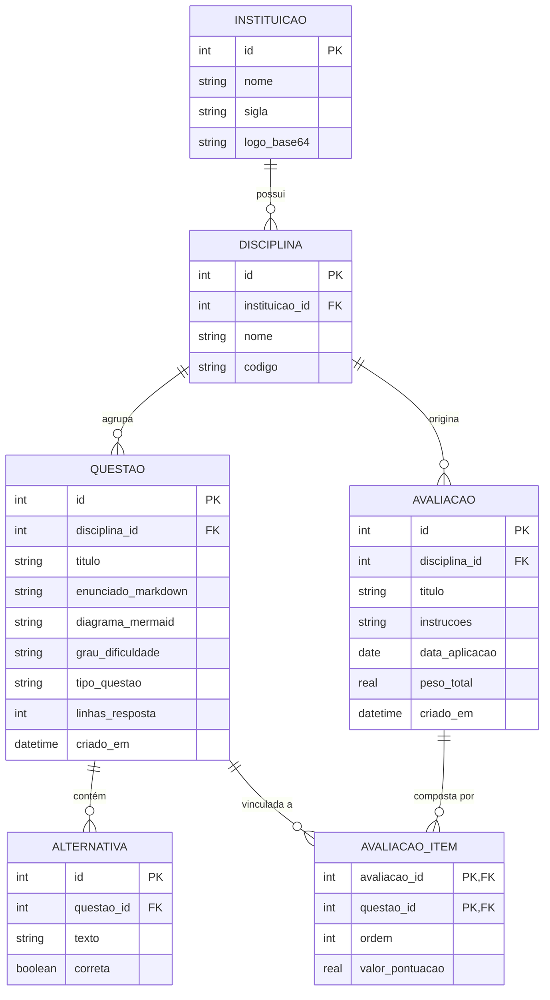

# SisProva - Especificação Técnica e de Requisitos do Software

**Versão:** 1.0.0  
**Data da Especificação:** Setembro de 2026  
**Status:** Em Produção / Estável  
**Arquitetura:** Desktop Offline-First (Tauri v2 + Rust + React 19 + SQLite)  

---

## 1. Visão Geral do Produto

O **SisProva** (anteriormente denominado Avaliador Acadêmico) é uma aplicação desktop nativa concebida para atender docentes, coordenadores pedagógicos e instituições de ensino no processo de elaboração, organização, diagramação e impressão de avaliações acadêmicas formais.

### 1.1 Objetivo do Software
Fornecer um ambiente de alta produtividade, estritamente **100% offline**, no qual o professor possa:
1. Gerenciar um acervo categorizado de questões por disciplina e nível de dificuldade com persistência relacional ACID em SQLite.
2. Compor avaliações acadêmicas personalizadas com fórmulas matemáticas complexas (LaTeX/KaTeX), código-fonte formatado e diagramas vetoriais dinâmicos (Mermaid).
3. Visualizar em tempo real (*Live Preview*) a folha A4 com diagramação tipográfica idêntica ao documento impresso.
4. Ajustar flexivelmente espaços de resposta, permitindo tanto pautas tradicionais quanto espaço zero para uso de folha de respostas externa.
5. Imprimir ou exportar para PDF com cabeçalho institucional regulamentado, preservando proporções milimétricas e contraste preto-e-branco.

---

## 2. Arquitetura do Sistema

O sistema adota o modelo híbrido moderno do **Tauri v2**, separando a lógica de baixo nível e persistência de dados (Rust) da interface reativa de alta resolução (React + TypeScript).

### 2.1 Componentes da Arquitetura
1. **Frontend (React 19, TypeScript, Vite, Tailwind CSS):**
   - Comunicação assíncrona debounced para visualização em 60 FPS com `useDeferredValue`.
   - Renderização tipográfica via `react-markdown`, `remark-math` e `rehype-katex`.
   - Motor de diagramas vetoriais com `mermaid` client-side em sandbox SVG isolada.
   - Alternância de tema visual entre **Modo Claro** (alto contraste, limpo) e **Modo Monokai Escuro** (`#272822`, `#1e1f1c`).
2. **Camada IPC (Inter-Process Communication):**
   - Comunicação binária tipada via chamadas Tauri `invoke`, sem exposição de portas TCP/HTTP.
3. **Backend Nativo (Rust):**
   - Gerenciamento de ciclo de vida e comandos em `commands.rs`.
   - Conexão SQLite thread-safe através de `Mutex<rusqlite::Connection>`.
   - Habilitação obrigatória de `PRAGMA foreign_keys = ON`, `PRAGMA journal_mode = WAL` e `PRAGMA synchronous = NORMAL`.
4. **Persistência de Dados (SQLite):**
   - Banco único localizado em `%APPDATA%\AvaliadorApp\data.db` (Windows) ou `~/.avaliadorapp/data.db` (Linux/macOS).

---

## 3. Modelo de Dados Relacional (SQLite)

O SisProva adota estritamente integridade referencial com chaves primárias autoincrementais e exclusão em cascata (*ON DELETE CASCADE*) onde apropriado.

### 3.1 Dicionário de Dados

#### Tabela `instituicao`
| Coluna | Tipo | Restrições | Descrição |
|---|---|---|---|
| `id` | INTEGER | PRIMARY KEY AUTOINCREMENT | Identificador único |
| `nome` | TEXT | NOT NULL | Nome por extenso da instituição |
| `sigla` | TEXT | NULL | Sigla oficial (ex: UnB, USP, FATEC) |
| `logo_base64` | TEXT | NULL | Logotipo vetorizado ou imagem em Base64 |

#### Tabela `disciplina`
| Coluna | Tipo | Restrições | Descrição |
|---|---|---|---|
| `id` | INTEGER | PRIMARY KEY AUTOINCREMENT | Identificador único |
| `instituicao_id` | INTEGER | NOT NULL, FK -> instituicao(id) ON DELETE CASCADE | Vínculo institucional |
| `nome` | TEXT | NOT NULL | Nome da disciplina acadêmica |
| `codigo` | TEXT | NULL | Código da disciplina (ex: MAT101, ED202) |

#### Tabela `questao`
| Coluna | Tipo | Restrições | Descrição |
|---|---|---|---|
| `id` | INTEGER | PRIMARY KEY AUTOINCREMENT | Identificador único |
| `disciplina_id` | INTEGER | NOT NULL, FK -> disciplina(id) | Disciplina à qual pertence |
| `titulo` | TEXT | NOT NULL | Título mnemônico ou resumo do tópico |
| `enunciado_markdown` | TEXT | NOT NULL | Conteúdo formatado em Markdown + LaTeX |
| `diagrama_mermaid` | TEXT | NULL | Código-fonte do diagrama vetorial Mermaid |
| `grau_dificuldade` | TEXT | CHECK IN ('FACIL', 'MEDIO', 'DIFICIL') | Classificação pedagógica |
| `tipo_questao` | TEXT | CHECK IN ('DISSERTATIVA', 'OBJETIVA', 'CODIGO') | Estrutura da resposta |
| `linhas_resposta` | INTEGER | DEFAULT 6, >= 0 | Quantidade de linhas pautadas (0 = sem pauta) |
| `criado_em` | DATETIME | DEFAULT CURRENT_TIMESTAMP | Registro temporal |

#### Tabela `alternativa`
| Coluna | Tipo | Restrições | Descrição |
|---|---|---|---|
| `id` | INTEGER | PRIMARY KEY AUTOINCREMENT | Identificador único |
| `questao_id` | INTEGER | NOT NULL, FK -> questao(id) ON DELETE CASCADE | Vínculo com a questão de múltipla escolha |
| `texto` | TEXT | NOT NULL | Texto descritivo da alternativa |
| `correta` | BOOLEAN | NOT NULL DEFAULT 0 | 1 para resposta correta (gabarito), 0 para distrator |

#### Tabela `avaliacao`
| Coluna | Tipo | Restrições | Descrição |
|---|---|---|---|
| `id` | INTEGER | PRIMARY KEY AUTOINCREMENT | Identificador único |
| `disciplina_id` | INTEGER | NOT NULL, FK -> disciplina(id) | Disciplina do exame |
| `titulo` | TEXT | NOT NULL | Título da prova (ex: Avaliação Bimestral II) |
| `instrucoes` | TEXT | NULL | Normas acadêmicas para o estudante |
| `data_aplicacao` | DATE | NULL | Data da aplicação |
| `peso_total` | REAL | DEFAULT 10.0 | Valor total da avaliação (soma das notas) |
| `criado_em` | DATETIME | DEFAULT CURRENT_TIMESTAMP | Timestamp de criação |

#### Tabela `avaliacao_item`
| Coluna | Tipo | Restrições | Descrição |
|---|---|---|---|
| `avaliacao_id` | INTEGER | NOT NULL, FK -> avaliacao(id) ON DELETE CASCADE | Chave composta |
| `questao_id` | INTEGER | NOT NULL, FK -> questao(id) | Chave composta |
| `ordem` | INTEGER | NOT NULL | Posição sequencial na prova (1, 2, 3...) |
| `valor_pontuacao` | REAL | NOT NULL | Pontos atribuídos a esta questão |

---

## 4. Requisitos Funcionais (RF)

### 4.1 Módulo de Gestão Acadêmica e Institucional
- **RF01 - Cadastro de Instituições:** O sistema deve permitir criar, editar e excluir instituições de ensino, cadastrando nome, sigla e logotipo.
- **RF02 - Cadastro de Disciplinas:** O docente pode cadastrar disciplinas vinculadas a uma instituição com nome e código de turma/departamento.
- **RF03 - Exclusão em Cascata:** Ao excluir uma instituição, as disciplinas e provas correspondentes são apagadas com garantia de integridade relacional.

### 4.2 Módulo de Banco de Questões
- **RF04 - CRUD de Questões:** Criação, edição, exclusão e busca de questões com filtros por disciplina, texto de busca e nível de dificuldade.
- **RF05 - Tipologias de Questão:**
  - *Dissertativa:* Com quantidade personalizável de pautas ou zero linhas.
  - *Objetiva (Múltipla Escolha):* Com alternativas dinâmicas e marcação da resposta correta para gabarito.
  - *Código:* Caixa pautada com numeração de linhas estilizada para disciplinas de computação e algoritmos.
- **RF06 - Fórmulas Matemáticas KaTeX:** Suporte a equações inline `$f(x)$` e em bloco `$$\int_{a}^{b} f(x) dx$$` com renderização tipográfica offline.
- **RF07 - Diagramas Vetoriais Mermaid:** Suporte a fluxogramas (`graph TD`), diagramas de sequência, mapas mentais e diagramas de classe.
- **RF08 - Inserção de Snippets Rápidos:** Botões de inserção direta para integrais, limites, matrizes, blocos de código e tabelas.

### 4.3 Módulo de Montagem e Edição de Provas (ExamBuilder)
- **RF09 - Metadados da Avaliação:** Configuração de título, instituição, disciplina, data, peso total e instruções gerais.
- **RF10 - Inclusão de Questões na Prova:**
  - Adição a partir do banco de questões relacional.
  - Adição rápida inline (criação instantânea e inclusão no exame).
- **RF11 - Edição de Questões Já Inseridas na Avaliação:**
  - O docente pode editar qualquer questão já adicionada ao exame (mesmo as vindas do Banco de Questões).
  - Pode optar por **Salvar Alterações** (atualiza no SQLite e na prova) ou **Salvar como Nova Cópia** (duplica no SQLite com novo ID, preservando a questão original no acervo).
- **RF12 - Reordenação e Pontuação:**
  - Mover questões para cima e para baixo alterando a ordem impressa.
  - Definição individual de pontuação por questão com soma visível.
- **RF13 - Linhas de Resposta Pautadas Configuráveis:**
  - Permite valor `0`, eliminando qualquer espaço de resposta impresso para avaliações com folha de respostas externa.
  - Sem limite máximo rígido de linhas.
  - Atalhos pré-definidos (`0`, `4`, `8`, `12`, `16`, `24`, `32`).

### 4.4 Módulo de Visualização e Impressão (Live Preview A4)
- **RF14 - Live Preview Split-Pane em Tempo Real:** Renderização visual contínua a 60 FPS com debouncing e zoom proporcional (60% a 130%).
- **RF15 - Modo Conferência / Gabarito:** Alternância de visibilidade do gabarito das questões objetivas para conferência do professor.
- **RF16 - Impressão Fiel A4:**
  - Acionamento direto via `@media print`.
  - Proporção rígida A4 (210 mm x 297 mm), margens padronizadas e contraste estritamente preto-e-branco.
  - Quebra de página inteligente (`break-inside: avoid`) para não cindir cabeçalhos e diagramas no meio da página.
- **RF18 - Geração e Impressão de Folha de Respostas (Gabarito OMR):**
  - Geração automática de folha de respostas/gabarito oficial sincronizada com as questões da avaliação.
  - Grade de bolhas preenchíveis `(A) (B) (C) (D) (E)` para questões objetivas e caixas compactas para dissertativas/código.
  - Múltiplos layouts de economia de papel: 1 folha por A4, 2 folhas por A4 (com linha de corte no meio - economia de 50%) e 4 folhas por A4 (quadrantes).
  - Modo máscara de gabarito com bolhas corretas preenchidas para conferência rápida.
  - Impressão exclusiva e independente da folha de respostas via `@media print`.

### 4.5 Módulo de Temas e Acessibilidade Visual
- **RF17 - Alternador de Temas (Claro & Monokai Escuro):**
  - Tema Claro com fundo branco e contraste suave para ambientes iluminados.
  - Tema Monokai com a paleta autêntica (`#272822`, `#1e1f1c`, `#34352f`, `#f8f8f2`, `#a6e22e`, `#66d9ef`, `#fd971f`, `#f92672`).
  - Persistência da preferência em `localStorage`.

---

## 5. Requisitos Não-Funcionais (RNF)

- **RNF01 - 100% Offline (Zero Cloud):** Nenhuma requisição a CDNs ou APIs na nuvem. Todas as fontes (KaTeX, Inter), estilos e scripts são empacotados localmente no binário.
- **RNF02 - Integridade ACID:** Toda gravação de prova e questão ocorre dentro de transações SQLite seguras com suporte a rollback automático em falhas.
- **RNF03 - Desempenho e Consumo de Memória:** O binário compilado em Rust/Tauri v2 consome menos de 65 MB de RAM em repouso e inicia em menos de 1 segundo.
- **RNF04 - Portabilidade Multiplataforma:** Código-fonte compatível com Windows 10/11 x64, Linux (Debian, Fedora, Ubuntu) e macOS.
- **RNF05 - Segurança Local:** Acesso ao banco de dados restrito ao processo nativo do aplicativo, sem portas de rede abertas.
- **RNF06 - Fidelidade Visual de Impressão:** Todo elemento na tela reflete com precisão milimétrica a saída física impressa ou gerada em PDF nativo pelo navegador de impressão.

---

## 6. Matriz de Rastreabilidade de Comandos Tauri (IPC)

| Comando Rust (`src-tauri/src/commands.rs`) | Função | Método do Frontend (`src/services/api.ts`) |
|---|---|---|
| `get_instituicoes` | Lista todas as instituições cadastradas | `api.getInstituicoes()` |
| `save_instituicao` | Insere ou atualiza instituição | `api.saveInstituicao(input)` |
| `delete_instituicao` | Remove instituição em cascata | `api.deleteInstituicao(id)` |
| `get_disciplinas` | Lista disciplinas cadastradas | `api.getDisciplinas()` |
| `save_disciplina` | Insere ou atualiza disciplina | `api.saveDisciplina(input)` |
| `delete_disciplina` | Remove disciplina | `api.deleteDisciplina(id)` |
| `get_questoes` | Retorna questões completas com alternativas | `api.getQuestoes()` |
| `get_questao_by_id` | Obtém uma questão específica | `api.getQuestaoById(id)` |
| `save_questao` | Insere ou atualiza questão com alternativas | `api.saveQuestao(input)` |
| `delete_questao` | Exclui questão do SQLite | `api.deleteQuestao(id)` |
| `get_avaliacoes` | Lista avaliações gravadas | `api.getAvaliacoes()` |
| `get_avaliacao_detalhe`| Carrega avaliação completa com seus itens e questões | `api.getAvaliacaoDetalhe(id)` |
| `save_avaliacao` | Grava avaliação e seus itens transacionalmente | `api.saveAvaliacao(input)` |
| `delete_avaliacao` | Exclui avaliação e desvincula itens | `api.deleteAvaliacao(id)` |
| `get_db_path` | Retorna o caminho físico do banco SQLite (.db) | `api.getDbPath()` |

---

## 7. Critérios de Aceite e Validação de Qualidade

1. **Compilação e Tipagem:** O projeto deve compilar sem nenhum erro (`npm run build` e `cargo check` retornam código 0).
2. **Edição de Questões:** Ao editar uma questão na avaliação, o preview e a impressão devem refletir imediatamente o novo enunciado, fórmulas e diagramas.
3. **Pauta Zero:** Configurar uma questão com `0` linhas de resposta deve suprimir integralmente a pauta na folha A4, sem deixar linhas em branco.
4. **Isolamento de Cor dos Gráficos:** Diagramas Mermaid devem apresentar fundo branco legível tanto no tema Claro quanto no tema Monokai escuro.
5. **Impressão:** O acionamento da impressão via `Ctrl+P` ou botão de imprimir deve exibir a prova em formato A4, com cabeçalho delimitado, fontes nítidas e sem quebra de blocos no meio das questões.
