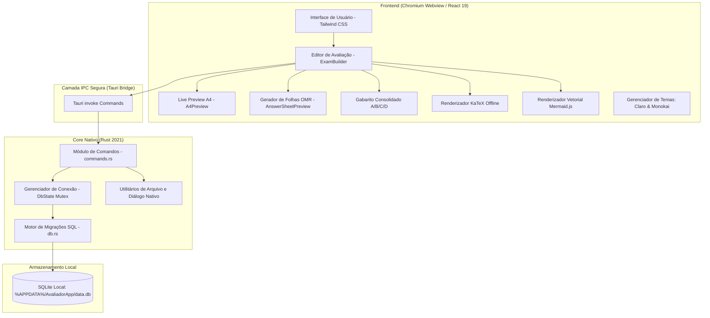
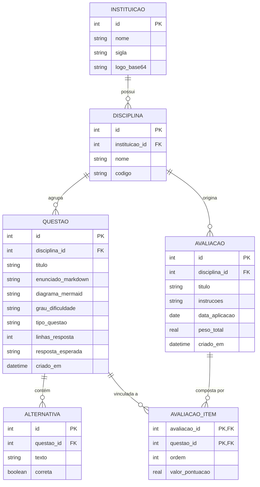

# SisProva - Especificação Técnica e de Requisitos do Software

**Versão:** 1.6.0 (Ciclos 1 a 4 Concluídos + Refinamento de Usabilidade, Acessibilidade e Alternativas Dinâmicas)  
**Data da Especificação:** Outubro de 2026  
**Status:** Em Produção / Estável  
**Arquitetura:** Desktop Offline-First (Tauri v2 + Rust + React 19 + SQLite)  

---

## 1. Visão Geral do Produto

O **SisProva** (anteriormente denominado Avaliador Acadêmico) é uma aplicação desktop nativa concebida para atender docentes, coordenadores pedagógicos e instituições de ensino no processo de elaboração, organização, diagramação e impressão de avaliações acadêmicas formais.

### 1.1 Objetivo do Software
Fornecer um ambiente de alta produtividade, estritamente **100% offline**, no qual o professor possa:
1. Gerenciar um acervo categorizado de questões por disciplina e nível de dificuldade com persistência relacional ACID em SQLite.
2. Compor avaliações acadêmicas personalizadas com fórmulas matemáticas complexas (LaTeX/KaTeX), código-fonte formatado e diagramas vetoriais dinâmicos (Mermaid).
3. Gerenciar espelhos de correção e padrões de resposta detalhados por questão (com suporte a Markdown e fórmulas matemáticas).
4. Gerar dinamicamente e imprimir duas modalidades essenciais de avaliação: **Versão do Aluno** (linhas de resposta pautadas ou limpas, alternativas desmarcadas e gabarito 100% oculto) e **Versão Gabarito / Professor** (respostas esperadas renderizadas no lugar das linhas, critérios docentes e alternativas destacadas).
5. Gerar variações de avaliações antifraude (**Tipos A, B, C e D**) com algoritmo determinístico e Folha de Gabaritos Consolidada.
6. Gerar e diagramar **Folhas de Resposta OMR padronizadas** (1, 2 ou 4 por folha A4 com máscara de gabarito para corte/correção perfurada).
7. Visualizar em tempo real (*Live Preview*) a folha A4 com diagramação tipográfica idêntica ao documento impresso.
8. Clonar e excluir avaliações com segurança transacional sem impactar o Banco de Questões compartilhado.
9. Imprimir via navegador ou exportar diretamente para PDF nativo de alta fidelidade (300 DPI equivalente) sem janelas intermediárias.
10. Exportar diretamente para **Microsoft Word (.docx)** editável com tabelas estruturadas, formatação matemática e pautas manuais.
11. Exportar para código-fonte **LaTeX (.tex)** compilável com pacotes acadêmicos (`amsmath`, `tcolorbox`, `listings`, `geometry`).
12. Controlar com precisão as margens A4, densidade vertical e escala percentual de impressão (80% a 105%) eliminando páginas órfãs.
13. Auditar a frequência de aplicação e recência de questões no acervo para prevenir repetições involuntárias em turmas consecutivas.
14. Customizar cabeçalhos formais através de 4 templates institucionais com upload, otimização e renderização de brasões/logotipos.
15. Calcular dinamicamente a pontuação da avaliação em tempo real a partir da soma dos pontos individuais atribuídos às questões.

---

## 2. Arquitetura do Sistema

O sistema adota o modelo híbrido moderno do **Tauri v2**, separando a lógica de baixo nível e persistência de dados (Rust) da interface reativa de alta resolução (React + TypeScript).

### 2.1 Componentes da Arquitetura
1. **Frontend (React 19, TypeScript, Vite, Tailwind CSS):**
   - Comunicação assíncrona debounced para visualização em 60 FPS com `useDeferredValue`.
   - Renderização tipográfica via `react-markdown`, `remark-math` e `rehype-katex`.
   - Motor de diagramas vetoriais com `mermaid` client-side em sandbox SVG isolada.
   - Alternância de tema visual entre **Modo Claro** (alto contraste, limpo) e **Modo Monokai Escuro** (`#272822`, `#1e1f1c`).
2. **Camada IPC (Inter-Process Communication):**
   - Comunicação binária tipada via chamadas Tauri `invoke`, sem exposição de portas TCP/HTTP.
3. **Backend Nativo (Rust):**
   - Gerenciamento de ciclo de vida e comandos em `commands.rs`.
   - Conexão SQLite thread-safe através de `Mutex<rusqlite::Connection>`.
   - Habilitação obrigatória de `PRAGMA foreign_keys = ON`, `PRAGMA journal_mode = WAL` e `PRAGMA synchronous = NORMAL`.
   - Suporte a diálogos nativos do SO (`save_pdf_dialog`) e gravação binária de arquivos em disco (`write_binary_file`).
4. **Persistência de Dados (SQLite):**
   - Banco único localizado em `%APPDATA%\AvaliadorApp\data.db` (Windows) ou `~/.avaliadorapp/data.db` (Linux/macOS).
   - Migrador automático de schema no startup garantindo retrocompatibilidade (ex: inserção de `resposta_esperada`).

---

## 3. Modelo de Dados Relacional (SQLite)

O SisProva adota estritamente integridade referencial com chaves primárias autoincrementais e exclusão em cascata (*ON DELETE CASCADE*) onde apropriado.

### 3.1 Dicionário de Dados

#### Tabela `instituicao`
| Coluna | Tipo | Restrições | Descrição |
|---|---|---|---|
| `id` | INTEGER | PRIMARY KEY AUTOINCREMENT | Identificador único |
| `nome` | TEXT | NOT NULL | Nome por extenso da instituição |
| `sigla` | TEXT | NULL | Sigla oficial (ex: UnB, USP, FATEC) |
| `logo_base64` | TEXT | NULL | Logotipo vetorizado ou imagem em Base64 |

#### Tabela `disciplina`
| Coluna | Tipo | Restrições | Descrição |
|---|---|---|---|
| `id` | INTEGER | PRIMARY KEY AUTOINCREMENT | Identificador único |
| `instituicao_id` | INTEGER | NOT NULL, FK -> instituicao(id) ON DELETE CASCADE | Vínculo institucional |
| `nome` | TEXT | NOT NULL | Nome da disciplina acadêmica |
| `codigo` | TEXT | NULL | Código da disciplina (ex: MAT101, ED202) |

#### Tabela `questao`
| Coluna | Tipo | Restrições | Descrição |
|---|---|---|---|
| `id` | INTEGER | PRIMARY KEY AUTOINCREMENT | Identificador único |
| `disciplina_id` | INTEGER | NOT NULL, FK -> disciplina(id) | Disciplina à qual pertence |
| `titulo` | TEXT | NOT NULL | Título mnemônico ou resumo do tópico |
| `enunciado_markdown` | TEXT | NOT NULL | Conteúdo formatado em Markdown + LaTeX |
| `diagrama_mermaid` | TEXT | NULL | Código-fonte do diagrama vetorial Mermaid |
| `grau_dificuldade` | TEXT | CHECK IN ('FACIL', 'MEDIO', 'DIFICIL') | Classificação pedagógica |
| `tipo_questao` | TEXT | CHECK IN ('DISSERTATIVA', 'OBJETIVA', 'CODIGO') | Estrutura da resposta |
| `linhas_resposta` | INTEGER | DEFAULT 6, >= 0 | Quantidade de linhas pautadas (0 = sem pauta) |
| `resposta_esperada` | TEXT | NULL | Padrão de resposta / espelho de correção em Markdown/LaTeX |
| `criado_em` | DATETIME | DEFAULT CURRENT_TIMESTAMP | Registro temporal |

#### Tabela `alternativa`
| Coluna | Tipo | Restrições | Descrição |
|---|---|---|---|
| `id` | INTEGER | PRIMARY KEY AUTOINCREMENT | Identificador único |
| `questao_id` | INTEGER | NOT NULL, FK -> questao(id) ON DELETE CASCADE | Vínculo com a questão de múltipla escolha |
| `texto` | TEXT | NOT NULL | Texto descritivo da alternativa |
| `correta` | BOOLEAN | NOT NULL DEFAULT 0 | 1 para resposta correta (gabarito), 0 para distrator |

#### Tabela `avaliacao`
| Coluna | Tipo | Restrições | Descrição |
|---|---|---|---|
| `id` | INTEGER | PRIMARY KEY AUTOINCREMENT | Identificador único |
| `disciplina_id` | INTEGER | NOT NULL, FK -> disciplina(id) | Disciplina do exame |
| `titulo` | TEXT | NOT NULL | Título da prova (ex: Avaliação Bimestral II) |
| `instrucoes` | TEXT | NULL | Normas acadêmicas para o estudante |
| `data_aplicacao` | DATE | NULL | Data da aplicação |
| `peso_total` | REAL | DEFAULT 10.0 | Valor total da avaliação (soma das notas) |
| `criado_em` | DATETIME | DEFAULT CURRENT_TIMESTAMP | Timestamp de criação |

#### Tabela `avaliacao_item`
| Coluna | Tipo | Restrições | Descrição |
|---|---|---|---|
| `avaliacao_id` | INTEGER | NOT NULL, FK -> avaliacao(id) ON DELETE CASCADE | Chave composta |
| `questao_id` | INTEGER | NOT NULL, FK -> questao(id) | Chave composta |
| `ordem` | INTEGER | NOT NULL | Posição sequencial na prova (1, 2, 3...) |
| `valor_pontuacao` | REAL | NOT NULL | Pontos atribuídos a esta questão |

---

## 4. Requisitos Funcionais (RF)

### 4.1 Módulo de Gestão Acadêmica e Institucional
- **RF01 - Cadastro de Instituições:** O sistema deve permitir criar, editar e excluir instituições de ensino, cadastrando nome, sigla e logotipo.
- **RF02 - Cadastro de Disciplinas:** O docente pode cadastrar disciplinas vinculadas a uma instituição com nome e código de turma/departamento.
- **RF03 - Exclusão em Cascata:** Ao excluir uma instituição, as disciplinas e provas correspondentes são apagadas com garantia de integridade relacional.

### 4.2 Módulo de Banco de Questões
- **RF04 - CRUD de Questões:** Criação, edição, exclusão e busca de questões com filtros por disciplina, texto de busca e nível de dificuldade.
- **RF05 - Tipologias de Questão:**
  - *Dissertativa:* Com quantidade personalizável de pautas ou zero linhas.
  - *Objetiva (Múltipla Escolha):* Com alternativas dinâmicas expansíveis via botão `+ Alternativa` (A, B, C, D, E, F...), remoção individual com proteção de mínimo de 2 alternativas, e marcação radio da alternativa correta para gabarito. Suportado no Banco de Questões (`QuestionBankModal`), na Edição da Prova (`EditExamQuestionModal`) e na Criação Rápida (`ExamBuilder`).
  - *Código:* Caixa pautada com numeração de linhas estilizada para disciplinas de computação e algoritmos.
- **RF06 - Fórmulas Matemáticas KaTeX:** Suporte a equações inline `$f(x)$` e em bloco `$$\int_{a}^{b} f(x) dx$$` com renderização tipográfica offline.
- **RF07 - Diagramas Vetoriais Mermaid:** Suporte a fluxogramas (`graph TD`), diagramas de sequência, mapas mentais e diagramas de classe.
- **RF08 - Inserção de Snippets Rápidos:** Botões de inserção direta para integrais, limites, matrizes, blocos de código e tabelas.
- **RF09 - Padrão de Resposta / Espelho de Correção na Questão:** Cadastro opcional de resposta esperada com suporte completo a Markdown, equações KaTeX e critérios de pontuação.

### 4.3 Módulo de Montagem e Edição de Provas (ExamBuilder)
- **RF10 - Metadados da Avaliação:** Configuração de título, instituição, disciplina, data, peso total e instruções gerais.
- **RF11 - Inclusão de Questões na Prova:**
  - Adição a partir do banco de questões relacional através de seletor rápido com confinamento flexbox (`min-w-0`, `truncate`), prevenindo que títulos longos desloquem o botão `+ Adicionar` para fora da tela.
  - Adição rápida inline (criação instantânea com padrão de resposta, suporte a alternativas dinâmicas e aviso informativo em alto contraste adaptativo WCAG).
- **RF12 - Edição de Questões Já Inseridas na Avaliação:**
  - O docente pode editar qualquer questão já adicionada ao exame (mesmo as vindas do Banco de Questões).
  - Pode optar por **Salvar Alterações** (atualiza no SQLite e na prova) ou **Salvar como Nova Cópia** (duplica no SQLite com novo ID, preservando a questão original no acervo).
- **RF13 - Reordenação e Pontuação:**
  - Mover questões para cima e para baixo alterando a ordem impressa.
  - Definição individual de pontuação por questão com soma visível e redistribuição automática.
- **RF14 - Linhas de Resposta Pautadas Configuráveis:**
  - Permite valor `0`, eliminando qualquer espaço de resposta impresso para avaliações com folha de respostas externa.
  - Sem limite máximo rígido de linhas.
  - Atalhos pré-definidos (`0`, `4`, `8`, `12`, `16`, `24`).
- **RF15 - Duplicação (Clonar Prova) e Exclusão Segura de Avaliações (MELH-06):**
  - **Ação "Nova Prova":** Inicializa um exame limpo com diálogo protetor contra perda de edições.
  - **Ação "Clonar Avaliação":** Duplica atômica e transacionalmente no SQLite (`clone_avaliacao`) título, disciplina, instruções, itens e pontuações, preservando as questões originais intactas.
  - **Ação "Excluir Avaliação":** Remove com segurança a avaliação e seus vínculos em `avaliacao_item`, exibindo aviso formal de que nenhuma questão do acervo será apagada.

### 4.4 Módulo de Visualização, Impressão e Modos de Avaliação
- **RF16 - Live Preview Split-Pane em Tempo Real e Fidelidade do Papel A4:**
  - Renderização visual contínua com debouncing e zoom proporcional (60% a 130%).
  - **Fidelidade da Folha A4 em Tela:** A área útil da folha A4 emula um documento impresso canônico; blocos de código (`pre`/`code`) e caixas de implementação preservam fundo claro legível (`bg-slate-50 border-slate-300 text-slate-800`), desacoplados do tema escuro da interface, em ambas as visualizações (Versão do Aluno e Versão Gabarito).
- **RF17 - Dualidade "Versão Aluno" vs. "Versão Gabarito (Professor)":**
  - **Seletor de Modo Segmentado:** Alternância imediata na barra de ferramentas entre `[ 🎓 Versão Aluno ]` e `[ 👨‍🏫 Versão Gabarito ]`.
  - **Versão Aluno:** Oculta rigorosamente todas as respostas esperadas; exibe pautas ou caixas de código vazias para escrita manual; mantém alternativas desmarcadas.
  - **Versão Gabarito (Professor):**
    - Identificador visual no cabeçalho com badge `[GABARITO]` e subtítulo `— GABARITO DO PROFESSOR / ESPELHO DE CORREÇÃO`.
    - Alternativas corretas assinaladas com selo `(CORRETA)`.
    - Questões dissertativas e de código substituem as pautas vazias por um bloco estilizado `[Padrão de Resposta Esperado — Gabarito do Professor]` renderizado em Markdown + KaTeX, economizando espaço em folha.
    - Rodapé com selo de espelho docente para conferência.
- **RF18 - Geração e Impressão de Folha de Respostas OMR (MELH-01):**
  - Sincronização automática das questões objetivas e dissertativas em folha de leitura óptica padronizada.
  - Layouts de economia: 1 por folha, 2 por folha (linha de corte central - 50% de economia) e 4 por folha (quadrantes).
  - Modo Máscara de Gabarito com bolhas preenchidas para correção rápida perfurada.
- **RF19 - Variações de Provas (Tipos A, B, C, D) e Gabarito Adaptativo (MELH-02):**
  - Geração paramétrica de 2 a 4 versões da prova via PRNG Mulberry32 determinístico baseado em semente (*seed*).
  - Embaralhamento em dois níveis: ordem das questões e ordem das alternativas internas.
  - Identificação clara do tipo no cabeçalho e rodapé do caderno de prova e folha OMR.
  - **Folha de Gabarito Adaptativa:**
    - *Com variações ativas:* Exibe a **Folha de Gabaritos Consolidada** com matriz comparativa lado a lado (Prova A, Prova B, C, D), posições relativas e distribuição estatística de alternativas por versão.
    - *Com variações inativas (versão única):* Exibe o **Gabarito Oficial do Professor** em coluna única oficial, suprimindo colunas duplicadas de tipos inexistentes, desativando rótulos de shuffle e exibindo a distribuição estatística exclusiva da avaliação canônica.
- **RF20 - Exportação Direta para PDF Nativo sem Diálogo do Navegador (MELH-03):**
  - Conversão de alta fidelidade (300 DPI equivalente) via `html2canvas` 2x + `jsPDF` em escala A4 exata (210 mm x 297 mm).
  - Fatiamento multi-páginas inteligente sem cortes de equações ou diagramas.
  - Diálogo nativo do sistema operacional (`save_pdf_dialog`) e gravação binária (`write_binary_file`).
  - Nomenclatura dinâmica e descritiva dos arquivos (ex: `Avaliacao_Algoritmos_Tipo_A_Versao_Aluno.pdf` ou `..._Versao_Gabarito.pdf`).
- **RF21 - Impressão Fiel A4 Tradicional:**
  - Acionamento direto via `@media print`.
  - Proporção rígida A4, margens padronizadas e contraste estritamente preto-e-branco.
  - Quebra de página inteligente (`break-inside: avoid; page-break-inside: avoid;`) para evitar corte de questões e critérios ao meio.

### 4.5 Módulo de Temas e Acessibilidade Visual
- **RF22 - Alternador de Temas (Claro & Slate Modern Dark):**
  - Tema Claro com fundo branco e contraste suave para ambientes iluminados.
  - Tema Escuro Slate Moderno (`#0f172a`, `#1e293b`, `#334155`, `#f8fafc`, `#6366f1`) para conforto visual prolongado.
  - Persistência da preferência em `localStorage`.

### 4.6 Módulo de Interoperabilidade, Backup e Histórico (Ciclo 2)
- **RF23 - Importação e Exportação de Questões em Lote (MELH-05):**
  - Exportação estruturada em **JSON** e **Markdown** limpo com fórmulas KaTeX, diagramas Mermaid e respostas esperadas.
  - Modal de importação em lote com upload e seleção de arquivo via diálogo nativo (`pick_text_file_dialog`).
  - Parser inteligente com detecção de dificuldade, tipologias, pautas, gabaritos `[x]` e espelho docente.
  - Pré-visualização interativa com seleção seletiva por cards e gravação transacional atômica no SQLite (`save_questoes_lote`).
- **RF24 - Histórico de Alterações com Desfazer/Refazer (`Ctrl+Z` / `Ctrl+Y`) no Editor (MELH-07):**
  - Pilha de estados (*past*, *present*, *future*) em memória para as operações do `ExamBuilder`.
  - Captura automática de snapshots antes de adições, exclusões, reordenação de itens e alterações de pontuação.
  - Botões visuais de Desfazer e Refazer na barra de ferramentas superior do editor com tooltips e contadores.
  - Atalhos de teclado globais `Ctrl+Z` / `Ctrl+Y` / `Ctrl+Shift+Z` com proteção contra interceptação em caixas de texto.
- **RF25 - Backup e Restauração em Arquivo Único (`.sisprova` / SQLite) (MELH-09):**
  - **Fazer Backup (.sisprova):** Criação de snapshot atômico e íntegro do SQLite através do comando `VACUUM INTO` sem travar conexões ativas.
  - **Restaurar Backup:** Validação prévia de integridade (`quick_check` e checagem de schema), liberação de locks de arquivos no Windows, backup preventivo (`data.db.bak`), restauração dos dados e reexecução de migrações.
  - Acesso direto via botão "Backup (.sisprova)" na barra superior e na aba de Banco de Dados das Configurações.

### 4.7 Módulo de Exportação Multi-Formato Externa (Ciclo 4)
- **RF26 - Exportação Editável para Microsoft Word (.docx) (MELH-04):**
  - Gerador nativo com motor `docx` compilando parágrafos, runs tipográficos e tabelas estruturadas.
  - Conversão de Markdown (negrito, itálico, código monoespaçado, equações matemáticas).
  - Tabela de cabeçalho formatada conforme estilo ativo (`padrao`, `compacto`, `concurso`, `minimo`).
  - Dualidade de modos: Versão do Aluno (com pautas pontilhadas) vs. Versão Gabarito (tabela resumo e respostas esperadas).
  - Suporte a diálogo nativo de salvamento no Tauri e download direto no navegador.
- **RF27 - Exportação Compilável para LaTeX (.tex) (MELH-04):**
  - Geração de código-fonte `.tex` autocontido com preâmbulo completo (`article`, `babel[brazil]`, `geometry`, `listings`, `tcolorbox`, `amsmath`).
  - Conversão de equações KaTeX em notação nativa LaTeX e blocos de código com destaque de sintaxe.
  - Cabeçalho formal configurável adaptando-se aos 4 estilos institucionais.
  - Alternador para inclusão de espelho docente e soluções esperadas.

### 4.8 Módulo de Formatação Avançada, Auditoria e Customização Visual (Ciclo 3)
- **RF28 - Controle Fino de Margens, Densidade e Escala de Impressão A4 (MELH-12):**
  - Modal dedicado com ajustes visuais em tempo real.
  - Escala percentual de impressão de 80% a 105% com atalhos rápidos para eliminar páginas órfãs.
  - Predefinições de margem (Compacta: 10mm, Padrão: 16mm, Ampla: 22mm) e controle milimétrico fino.
  - Densidade de espaçamento (Compacta, Padrão, Ampla) e tamanho tipográfico da fonte (12px, 13.5px, 15px).
  - Injeção dinâmica de CSS `@page` para saída idêntica na impressora e no PDF nativo.
- **RF29 - Estatísticas, Linha do Tempo e Histórico de Utilização de Questões (MELH-10):**
  - Consulta relacional de uso cruzando avaliações, datas de aplicação e disciplinas.
  - Badges semânticos no acervo: *✨ Inédita*, *📋 Usada* e *⚠️ Recente (< 6 meses)* prevenindo repetições involuntárias.
  - Modal de linha do tempo com histórico detalhado de provas onde cada questão foi aplicada.
  - Filtros instantâneos no Banco de Questões por frequência de aplicação.
- **RF30 - Templates de Cabeçalho Institucional Personalizáveis (MELH-08):**
  - Suporte a 4 estilos pré-configurados: *Universitário/Padrão*, *Compacto/Econômico* (economia de 60% de altura), *Vestibular/Concurso* (solene com regras e assinaturas) e *Mínimo/Simulado* (linha única).
  - Fidelidade garantida no Live Preview A4, Impressão Física, PDF Nativo, Microsoft Word (.docx) e LaTeX (.tex).
- **RF31 - Gestão e Renderização de Brasão / Logotipo Institucional:**
  - Upload direto de imagens (`PNG`, `JPG`, `SVG`, `WebP`) no cadastro de instituições e no painel de metadados da avaliação.
  - Otimização automática client-side via canvas a 400px para garantir impressão em 300 DPI sem sobrecarregar SQLite.
  - Exibição dinâmica no cabeçalho do caderno de prova, folha de respostas OMR e espelho consolidado.
- **RF32 - Cálculo Reativo e Dinâmico da Pontuação da Avaliação:**
  - Recálculo contínuo da pontuação total a partir da soma dos pontos atribuídos a cada questão.
  - Atualização instantânea na barra de ferramentas e no bloco "Valor Total" do cabeçalho de visualização e exportação.

---

## 5. Requisitos Não-Funcionais (RNF)

- **RNF01 - 100% Offline (Zero Cloud):** Nenhuma requisição a CDNs ou APIs na nuvem. Todas as fontes (KaTeX, Inter), estilos e scripts são empacotados localmente no binário.
- **RNF02 - Integridade ACID:** Toda gravação de prova, duplicação e exclusão ocorre dentro de transações SQLite seguras com suporte a rollback automático.
- **RNF03 - Desempenho e Consumo de Memória:** O binário compilado em Rust/Tauri v2 consome menos de 65 MB de RAM em repouso e inicia em menos de 1 segundo.
- **RNF04 - Portabilidade Multiplataforma:** Código-fonte compatível com Windows 10/11 x64, Linux (Debian, Fedora, Ubuntu) e macOS.
- **RNF05 - Segurança Local:** Acesso ao banco de dados restrito ao processo nativo do aplicativo, sem portas de rede abertas.
- **RNF06 - Fidelidade Visual de Impressão:** Todo elemento na tela reflete com precisão milimétrica a saída física impressa ou gerada em PDF nativo pelo motor de impressão.

---

## 6. Matriz de Rastreabilidade de Comandos Tauri (IPC)

| Comando Rust (`src-tauri/src/commands.rs`) | Função | Método do Frontend (`src/services/api.ts`) |
|---|---|---|
| `get_instituicoes` | Lista todas as instituições cadastradas | `api.getInstituicoes()` |
| `save_instituicao` | Insere ou atualiza instituição | `api.saveInstituicao(input)` |
| `delete_instituicao` | Remove instituição em cascata | `api.deleteInstituicao(id)` |
| `get_disciplinas` | Lista disciplinas cadastradas | `api.getDisciplinas()` |
| `save_disciplina` | Insere ou atualiza disciplina | `api.saveDisciplina(input)` |
| `delete_disciplina` | Remove disciplina | `api.deleteDisciplina(id)` |
| `get_questoes` | Retorna questões completas com alternativas e `resposta_esperada` | `api.getQuestoes()` |
| `get_questao_by_id` | Obtém uma questão específica pelo ID | `api.getQuestaoById(id)` |
| `save_questao` | Insere ou atualiza questão com alternativas e `resposta_esperada` | `api.saveQuestao(input)` |
| `delete_questao` | Exclui questão do acervo SQLite | `api.deleteQuestao(id)` |
| `save_questoes_lote` | Insere lote massivo de questões e alternativas atomicamente | `api.saveQuestoesLote(questoes)` |
| `get_questoes_estatisticas_uso` | Retorna histórico e frequência de uso de todas as questões | `api.getQuestoesEstatisticasUso()` |
| `get_avaliacoes` | Lista avaliações gravadas | `api.getAvaliacoes()` |
| `get_avaliacao_detalhe`| Carrega avaliação completa com seus itens e questões vinculadas | `api.getAvaliacaoDetalhe(id)` |
| `save_avaliacao` | Grava avaliação e seus itens transacionalmente | `api.saveAvaliacao(input)` |
| `delete_avaliacao` | Exclui avaliação e desvincula itens (mantém Banco de Questões intacto) | `api.deleteAvaliacao(id)` |
| `clone_avaliacao` | Duplica atomicamente uma avaliação existente com seus itens | `api.cloneAvaliacao(id)` |
| `export_backup_dialog` | Gera snapshot íntegro via SQLite VACUUM em arquivo `.sisprova` | `api.exportBackupDialog(defaultName)` |
| `import_backup_dialog` | Valida integridade e restaura arquivo de backup `.sisprova` | `api.importBackupDialog()` |
| `save_pdf_dialog` | Abre caixa de diálogo nativa do SO para escolha do caminho do PDF | `api.savePdfDialog(filename)` |
| `save_text_file_dialog`| Abre diálogo nativo para salvar arquivos de texto (JSON / Markdown / Word / LaTeX) | `api.saveTextFileDialog(...)` |
| `pick_text_file_dialog`| Abre diálogo nativo para escolher arquivos de texto (JSON / Markdown) | `api.pickTextFileDialog(...)` |
| `write_text_file` | Grava conteúdo de texto UTF-8 diretamente no arquivo | `api.writeTextFile(path, content)` |
| `read_text_file` | Lê string UTF-8 de arquivo local sem passar por intermediários | `api.readTextFile(path)` |
| `write_binary_file` | Escreve array binário de bytes diretamente em arquivo no disco | `api.writeBinaryFile(path, data)` |
| `get_db_path` | Retorna o caminho físico do banco SQLite (.db) | `api.getDbPath()` |

---

## 7. Critérios de Aceite e Validação de Qualidade

1. **Compilação e Tipagem:** O projeto deve compilar sem nenhum erro (`npm run build` e `cargo check` retornam código 0).
2. **Edição de Questões:** Ao editar uma questão na avaliação, o preview e a impressão devem refletir imediatamente o novo enunciado, fórmulas, diagramas e resposta esperada.
3. **Padrão de Resposta / Gabarito:**
   - Na Versão Aluno, a resposta esperada não deve constar em nenhuma parte do DOM de impressão nem no Word/LaTeX do aluno.
   - Na Versão Gabarito, a resposta esperada deve ser renderizada com formatação Markdown e fórmulas KaTeX, e as linhas vazias suprimidas.
4. **Isolamento do Banco de Questões na Exclusão de Provas:** Excluir qualquer avaliação jamais pode excluir ou afetar as questões registradas no acervo geral da disciplina.
5. **Pauta Zero:** Configurar uma questão com `0` linhas de resposta deve suprimir integralmente a pauta na folha A4, sem deixar espaços em branco ociosos.
6. **Fidelidade de Exportação PDF:** O PDF gerado pelo botão nativo deve ter a mesma fidelidade de proporção e quebras de página da visualização de tela.
7. **Exportação Word (.docx) e LaTeX (.tex):** Os arquivos gerados devem abrir sem alertas de corrupção no Microsoft Word / LibreOffice e compilar com `pdflatex` sem erros.
8. **Controle Fino de Escala:** Ajustes de escala percentual (80% a 105%) e margens devem ser aplicados imediatamente no DOM e na regra `@page` de impressão.
9. **Auditoria Pedagógica:** Questões aplicadas em menos de 180 dias devem exibir o badge de alerta de recência com contagem de dias corridos.
10. **Templates de Cabeçalho e Brasão:** Todos os 4 estilos de cabeçalho devem renderizar o brasão da instituição (quando presente) e atualizar dinamicamente o valor total em pontos da prova.
11. **Gestão Flexível de Alternativas:** O docente deve conseguir adicionar alternativas subsequentes (E, F, etc.) ou removê-las tanto no Banco de Questões quanto na criação inline e no modal de edição, respeitando a trava de no mínimo 2 alternativas e reatribuindo a correta caso a opção ativa seja excluída.
12. **Confinamento de Layout e Fidelidade de Impressão:** Títulos longos no seletor de questões cadastradas não devem provocar estouro de layout do botão `+ Adicionar`, e blocos de código e caixas de implementação na folha A4 devem sempre manter fundo claro e legível, mesmo com o Modo Escuro ativo na aplicação.
